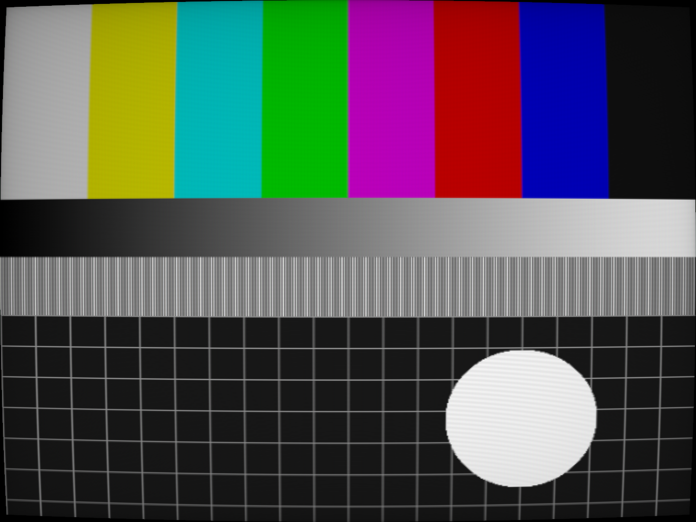

# dolphin-crt

A single-pass CRT post-processing shader for the [Dolphin](https://dolphin-emu.org) GameCube/Wii
emulator: gaussian scanlines on a virtual 480-line raster, mild screen curvature, a faint
aperture-grille mask, light bloom and a corner vignette. Dolphin ships no CRT shader of its own.



*Default settings on a synthetic test pattern ([source](docs/pattern.png)).*

It runs inside Dolphin's own present pass, so it adds no latency, unlike screen-capture CRT
overlays. It also has no phosphor persistence on purpose, because trails read as input lag.

## Install

1. Copy `Shaders/crt_scanlines.glsl` into Dolphin's user shader folder:
   - Linux: `~/.local/share/dolphin-emu/Shaders/` (Flatpak:
     `~/.var/app/org.DolphinEmu.dolphin-emu/data/dolphin-emu/Shaders/`)
   - Windows: `Documents\Dolphin Emulator\Shaders\` (or `User\Shaders\` in a portable install)
   - macOS: `~/Library/Application Support/Dolphin/Shaders/`
2. In Dolphin: **Graphics → Enhancements → Post-Processing Effect → crt_scanlines**.
3. **Configure** next to it opens the options below; changes show live.

Tested in-game on Dolphin 2512 (Linux, Vulkan). It uses only the calls Dolphin's bundled
shaders use.

## Options

| Option | Default | What it does |
|---|---|---|
| Virtual scanlines | 480 | Line count of the simulated tube. 240 gives chunky low-res lines. Independent of internal resolution, so 6x IR still shows visible lines. |
| Scanline hardness | -8 | More negative gives thinner lines with darker gaps. |
| Horizontal sharpness | -3 | More negative gives sharper pixels along each line. |
| Curvature X / Y | 0.02 / 0.03 | Barrel warp. 0 for a flat screen. |
| Aperture-grille mask | 0.15 | RGB stripe strength. Keep it low if the output is streamed, recorded or rescaled, because a fine mask moirés into rainbow rings after video encoding. |
| Bloom / halation | 0.15 | Soft glow around bright areas. |
| Corner vignette | 0.25 | Darkens the corners. |
| Brightness boost | 1.2 | Compensates for the light lost in scanline gaps. |

## Preview without Dolphin

`tools/glrender.py` renders the shader on any PNG using CPU-only OpenGL (OSMesa). It needs no GPU
and no display, and uses each option's default value:

```sh
pip install numpy Pillow PyOpenGL          # plus libOSMesa: apt install libosmesa6
python3 tools/testpattern.py pattern.png   # or use your own screenshot
env -u DISPLAY python3 tools/glrender.py Shaders/crt_scanlines.glsl pattern.png out.png
```

The tool stubs Dolphin's shader API (`GetResolution` reports a 6x-IR frame, `GetCoordinates` runs
0..1) to match Dolphin's semantics. Dolphin itself remains the reference.

## Credits and license

The algorithm follows Timothy Lottes' public-domain CRT scan-line shader: gaussian horizontal
filter, gaussian scanline weighting, warp and mask. This is an independent rewrite for Dolphin's
post-processing API, not a port of the libretro `crt-lottes` file.

Released under [CC0 1.0](LICENSE): public domain, no attribution required.
